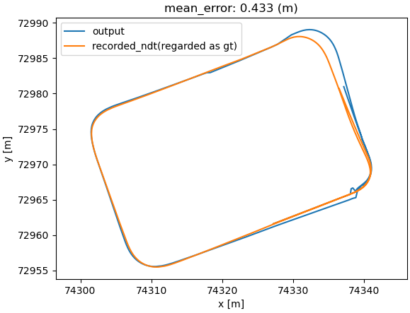

# AR Tag Based Localizer

**ArTagBasedLocalizer** is a vision-based localization package.


This package uses [the ArUco library](https://index.ros.org/p/aruco/) to detect AR-Tags from camera images and calculates and publishes the pose of the ego vehicle based on these detections.
The positions and orientations of the AR-Tags are assumed to be written in the Lanelet2 format.

This package includes two nodes.

- `ar_tag_based_localizer` : A node that detects AR-Tags from camera images and publishes the pose of the ego vehicle.
- `tag_tf_caster` : A node that publishes the pose of the AR-Tags applied in Lanelet2 as `tf_static`.

## Inputs / Outputs

### `ar_tag_based_localizer` node

#### Input

| Name                  | Type                           | Description  |
| :-------------------- | :----------------------------- | :----------- |
| `~/input/image`       | `sensor_msgs::msg::Image`      | Camera Image |
| `~/input/camera_info` | `sensor_msgs::msg::CameraInfo` | Camera Info  |

#### Output

| Name                            | Type                                            | Description                                                                               |
| :------------------------------ | :---------------------------------------------- | :---------------------------------------------------------------------------------------- |
| `~/output/pose_with_covariance` | `geometry_msgs::msg::PoseWithCovarianceStamped` | Estimated Pose                                                                            |
| `~/debug/result`                | `sensor_msgs::msg::Image`                       | [debug topic] Image in which marker detection results are superimposed on the input image |
| `tf`                            | `geometry_msgs::msg::TransformStamped`          | [debug topic] TF from camera to detected tag                                              |

### `tag_tf_caster` node

#### Input

| Name                   | Type                                         | Description      |
| :--------------------- | :------------------------------------------- | :--------------- |
| `~/input/lanelet2_map` | `autoware_auto_mapping_msgs::msg::HADMapBin` | Data of lanelet2 |

#### Output

| Name        | Type                                   | Description        |
| :---------- | :------------------------------------- | :----------------- |
| `tf_static` | `geometry_msgs::msg::TransformStamped` | TF from map to tag |

## How to launch

When launching Autoware, specify `artag` for `pose_source`.

```bash
ros2 launch autoware_launch ... \
    pose_source:=artag \
    ...
```

[Sample rosbag and map](https://drive.google.com/file/d/1wiCQjyjRnYbb0dg8G6mRecdSGh8tv3zR/view)

This dataset contains issues such as missing IMU data, and overall the accuracy is low. Even when running AR tag-based self-localization, significant difference from the true trajectory can be observed.

The image below shows the trajectory when the sample is executed and plotted.



The pull request video below should also be helpful.

<https://github.com/autowarefoundation/autoware.universe/pull/4347#issuecomment-1663155248>

## Architecture


## Principle

### `ar_tag_based_localizer` node


### `tag_tf_caster` node

The definitions of the tags written to the map are introduced in the next section. See `Map Specifications`.

The `tag_tf_caster` node publishes the TF from the map to the tag.

- Translation : The center of the four vertices of the tag
- Rotation : Let the vertex numbers be 1, 2, 3, 4 counterclockwise as shown in the next section. Direction is defined as the cross product of the vector from 1 to 2 and the vector from 2 to 3.

Users can define tags as Lanelet2 4-vertex polygons.
In this case, it is possible to define an arrangement in which the four vertices cannot be considered to be on the same plane. The direction of the tag in that case is difficult to calculate.
So, if the 4 vertices are considered as forming a tetrahedron and its volume exceeds the `volume_threshold` parameter, the tag will not publish tf_static.

## Map specifications

For this package to function correctly, the pose of the AR-Tags must be specified in the Lanelet2 map format that Autoware can interpret.

The four vertices of AR-Tag are defined counterclockwise.

The order of the four vertices is defined as follows. In the coordinate system of AR-Tag,

- the x-axis is parallel to the vector from the first vertex to the second vertex
- the y-axis is parallel to the vector from the second vertex to the third vertex


### example of `lanelet2_map.osm`

The values provided below are placeholders.
Ensure to input the correct coordinates corresponding to the actual location where the AR-Tag is placed, such as `lat`, `lon`, `mgrs_code`, `local_x`, `local_y`.

```xml
...

  <node id="1" lat="35.8xxxxx" lon="139.6xxxxx">
    <tag k="mgrs_code" v="99XXX000000"/>
    <tag k="local_x" v="22.2356"/>
    <tag k="local_y" v="87.4506"/>
    <tag k="ele" v="2.1725"/>
  </node>
  <node id="2" lat="35.8xxxxx" lon="139.6xxxxx">
    <tag k="mgrs_code" v="99XXX000000"/>
    <tag k="local_x" v="22.639"/>
    <tag k="local_y" v="87.5886"/>
    <tag k="ele" v="2.5947"/>
  </node>
  <node id="3" lat="35.8xxxxx" lon="139.6xxxxx">
    <tag k="mgrs_code" v="99XXX000000"/>
    <tag k="local_x" v="22.2331"/>
    <tag k="local_y" v="87.4713"/>
    <tag k="ele" v="3.0208"/>
  </node>
  <node id="4" lat="35.8xxxxx" lon="139.6xxxxx">
    <tag k="mgrs_code" v="99XXX000000"/>
    <tag k="local_x" v="21.8298"/>
    <tag k="local_y" v="87.3332"/>
    <tag k="ele" v="2.5985"/>
  </node>

...

  <way id="5">
    <nd ref="1"/>
    <nd ref="2"/>
    <nd ref="3"/>
    <nd ref="4"/>
    <tag k="type" v="pose_marker"/>
    <tag k="subtype" v="apriltag_16h5"/>
    <tag k="area" v="yes"/>
    <tag k="marker_id" v="0"/>
  </way>

...

```
